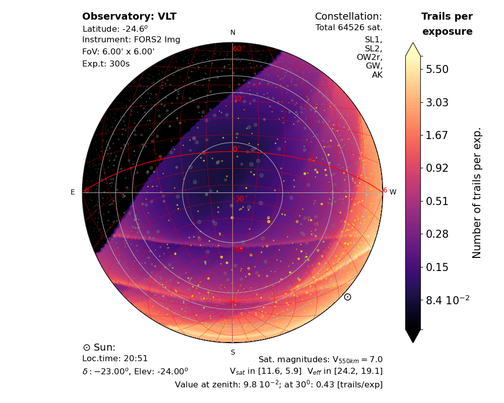
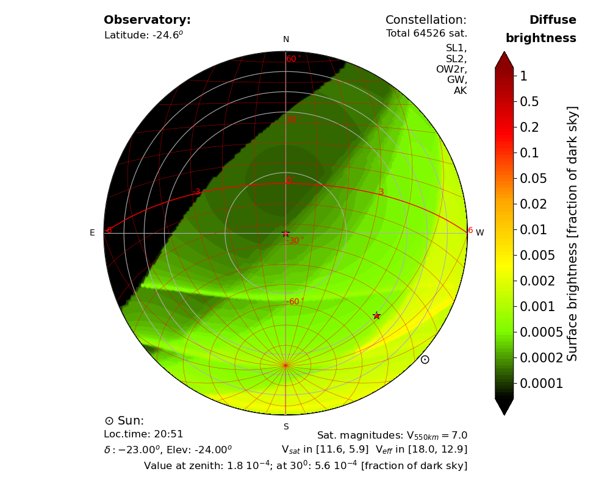
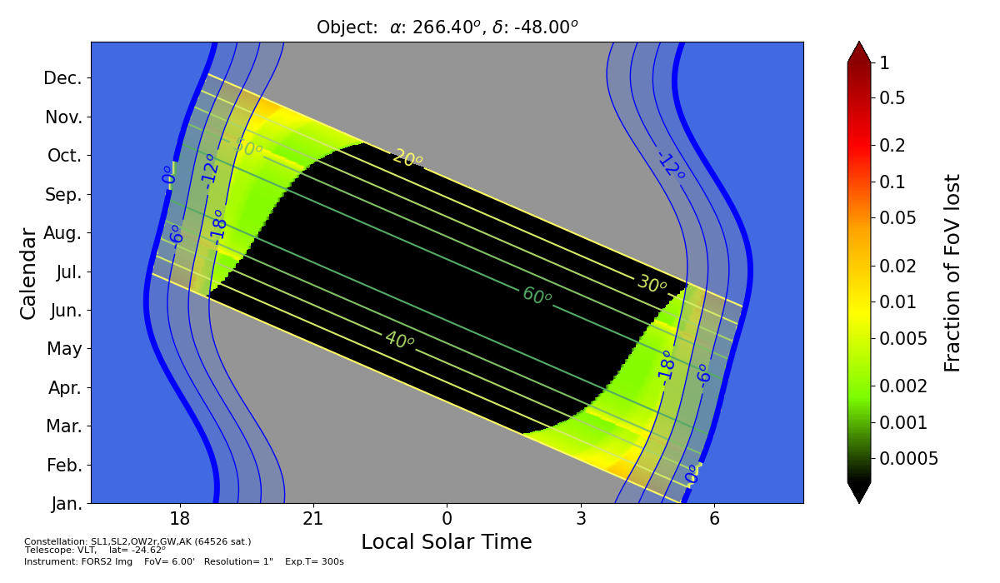
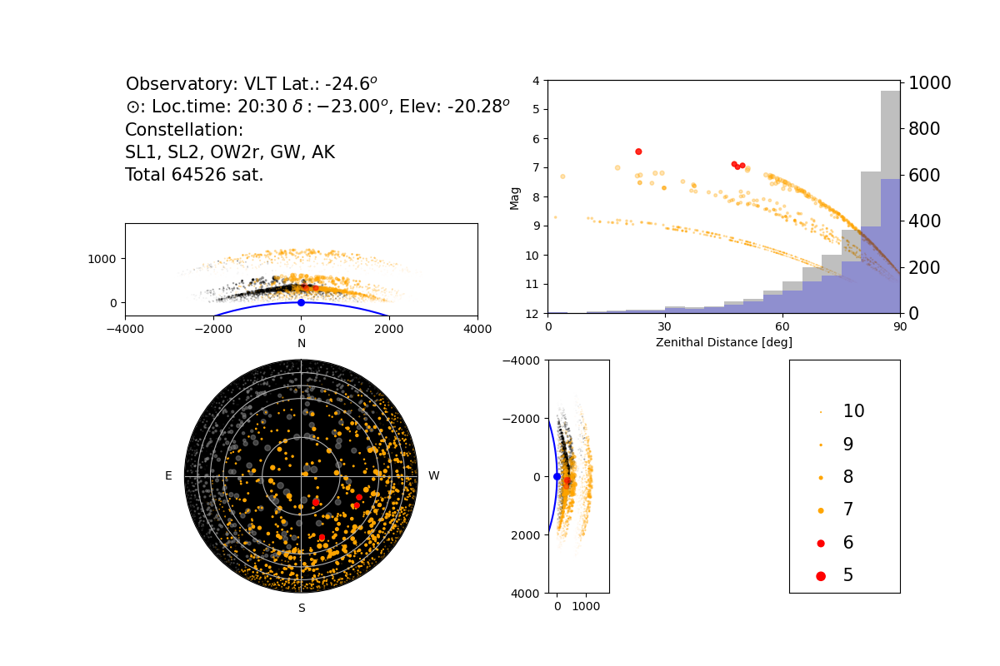
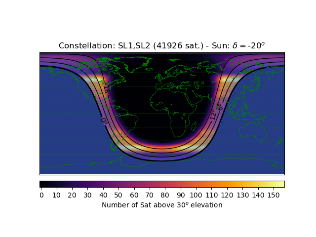
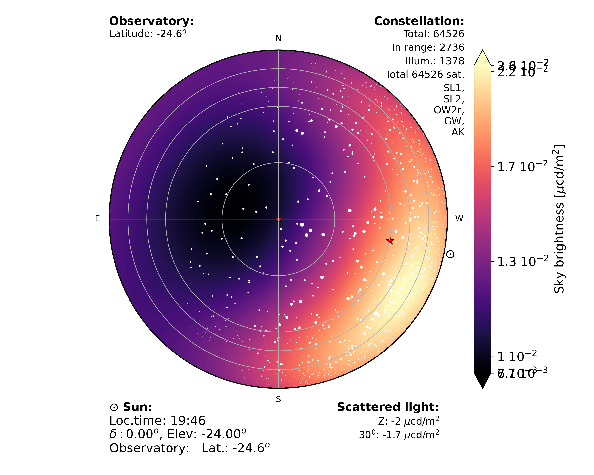

# SatConAnalytic

v 2.0, 2026-Mar-01

## Table of content
- [SatConAnalytic](#satconanalytic)
  - [Table of content](#table-of-content)
  - [Introduction](#introduction)
  - [Setup files](#setup-files)
    - [Constellations](#constellations)
    - [Telescopes and Instruments](#telescopes-and-instruments)
    - [Installation](#installation)
  - [Script Usage](#script-usage)
    - [obsSky](#obssky)
      - [Options](#options)
      - [Examples:](#examples)
    - [objectCalendar](#objectcalendar)
      - [Options:](#options-1)
      - [Examples:](#examples-1)
    - [satDots](#satdots)
      - [Options](#options-2)
      - [Example:](#example)
    - [earthMap](#earthmap)
      - [Example:](#example-1)
    - [scatteredLight](#scatteredlight)
      - [Example:](#example-2)
    - [Batch mode](#batch-mode)
  - [Files and libraries](#files-and-libraries)
  - [Library](#library)
  - [Other implementation](#other-implementation)

## Introduction

This package provides analytic simulations of satellite mega-constellations (Starlink, OneWeb...), to evaluate their effects on astronomical observations. 

The effects evaluated include:
- Number of trail per observation,
- Field-of-view loss,
- Diffuse light pollution (by the satellites too faint to be detected as trails),
- Scattered light pollution.

and some additional information such as satellite density (in satellites per square degrees).

Instead of computing the position of each individual satellite, the constellation is considered as a density function, which can be treated analytically. This method is infinitely faster, and is rigorous.

The method is described in our paper "Analytical simulations of the effect of satellite constellations on optical and near-infrared observations," Bassa, Hainaut, Galadí-Enríquez (2022) A&A 657, A75, [ADS 2022A&A...657A..75B](https://ui.adsabs.harvard.edu/abs/2022A%26A...657A..75B/abstract) [DOI 10.1051/0004-6361/202142101](https://ui.adsabs.harvard.edu/link_gateway/2022A&A...657A..75B/doi:10.1051/0004-6361/202142101). Since version 2, the package also includes simulations of the sky background pollution, in terms of diffuse light and scattered light, as described in Hainaut 2025.

A generic introduction to the issue of satellite constellations and their impact on astronomical observations is available on my [web](https://www.eso.org/~ohainaut/satellites).

The simulators (using an older version of the package) are also available as [web-tools](https://www.eso.org/~ohainaut/satellites/simulators.html).

Jump to section [Script Usage](#Script-Usage) Script Usage for the simulator scripts.


## Setup files

### Constellations

`constellation.py` reads a json file and returns it as a list of Constellation objects.

`constellation.json` has a list of pre-defined constellations, as follows:

```
SL1old :         "Starlink Gen-1 (old)"  10627 sat, 8 shells
SL1 :    "Starlink Gen-1 SAT-MOD-20200417-00037"         11926 sat, 8 shells
SL2 :    "Starlink Gen-2"        30000 sat, 8 shells
ESP :    "ESPACE Rwanda"         337323 sat, 28 shells
OW2o :   "OneWeb-2 (original)"   47844 sat, 3 shells
OW2r :   "OneWeb-2 (reduced 2021)"       6372 sat, 3 shells
GW :     "Guo Wang (China) GW-A59 -2"    12992 sat, 7 shells
AK :     "Amazon Kuiper"         3236 sat, 3 shells
GS :     "Galaxy Space  Yinhe"   1000 sat, 1 shells
HWS :    "HanWha systems"        2000 sat, 1 shells
LGC :    "Lynk Global cell"      2000 sat, 1 shells
YESTERDAY :  "Today"s pre-constellation satellites (2020)"   2725 sat, 3 shells
TODAYconst :     "Starlink and ONEWEB 2022-APR"  1763 sat, 2 shells
```

Run `constellations.py` for a detailed list.

Some meta-constellations are available in obsplot and objplot, for convenience:

- SL = SL1 + SL2
- OW = OW2r
- SLOW = SL1 + SL2 + OW2r
- TODAY = YESTERDAY + TODAYconst
- SLOWGWAK = YESTERDAY, SL1, SL2, OW2r, GW, AK 
- ALL = YESTERDAY, SL1, SL2, OW2r, GW, AK, ESP


### Telescopes and Instruments

`telescopes.py` reads a json file defining the telescope and instrument parameters and return a list of Telescope objects.

The JSON must have the following structure


```
    {
        "code" : "FORSimg",           # a code name to identify the instrument.
        "telescope"   : "VLT",        # name of the telescope (for label). 
                                        Default ""
        "lat"         : -24.62,       # latitude of the observatory [deg]. 
                                        Default -24.62
        "instrument"  : "FORS2 Img",  # name of the instrument (for label). 
                                        Default ""
        "expt"        : 300.0,        # exposure time [s]. Default 1.0s
        "fovl_arcsec"        : 360.0, # length of the FoV [arcsec]. Default 1.0"
        "fovw_arcsec"        : 360.0, # width the FoV [arcsec]. 
                                        Default fovl_arcec
        "resol_arcsec"       : 1.0,   # resolution (seeing or pixel) [arcsec]. 
                                        Default 1.0"
        "maglim"      : 25.2,         # limiting magnitude (for expt). 
                                        Default  99.
        "magbloom"    : 18.5,         # dramatic saturation magnitude. 
                                        Default -99
        "trail_arcsec"      : 5.0     # width of a satellite trail [arcsec]. 
                                        Default 5."
    }
```

All (but code) can be ommitted; the default values will be used.

Alternative attributes can be defined:
```
        "fovl"        : length of the FoV [deg]. 
                        Default  0.00027778 (1arcsec)
        "fovw"        : width the FoV [deg]. Default fovl
        "resol"       : resolution (seeing or pixel) [deg]. 
                        Default  0.00027778 (1arcsec)
        "trailf"      : width of the trail relative to fovl. 
                        Default trail_arcsec/fovl_arcsec
```

The `telescopes.json` file contains definition for:

```
WFI:            MPE/ESO 2.2m WFI
VST:            VST OmegaCam
EFOSC:          NTT EFOSC2 imaging
FORSimg:        VLT FORS2 Imaging
HAWKI:          VLT HAWKI
MICADO:         ELT MICADO
FORSspec:       VLT FORS2 Spec
UVES:           VLT UVES
XSHOOTER:       VLT X-SHOOTER
UVES1h:         VLT UVES
4MOST:          VISTA 4MOST LowResolution
4MOSTH:         VISTA 4MOST HighResolution
LAMOST:         LAMOST MRS
MOONS-LR:       VLT MOONS-LR
MOONS-HR:       VLT MOONS-LR
ESPRESSO:       VLT ESPRESSO
VISIR:          VLT VISIR thermal imaging
VISIR1:         VLT VISIR
ELTHrm:         ELT HARMONY
ELTMetImg:      ELT METIS Imaging
ELTMetLng:      ELT METIS Long Slit
ELTMicImg:      ELT MICADO Imaging
ELTMicLng:      ELT MICADO Long Slit 
FlyEye:         ESA FlyEye  
LSST:           VRO LSST
Cat703:         0.7m Catalina CCD
CatG96:         1.52m Catalina CCD
ZTF:            1.2m Oschin ZTF 
Binoc:          Binocular 10x70 from Brussels
Photo:          Photographic Camera from Brussels
ALMA:           ALMA beam
```

### Installation

Try ``make all``, which will pip install the package.

Or run directly ``python yourPath/SatConAnalytics/obsSky.py``

## Script Usage

This package comes with some ready-to-use scripts. They can use pre-defined instruments or define the instrument with command line parameters. The main function of most scripts can also be called from another script, see [batch mode](#batch-mode) below.


### obsSky


Plot satellite density over the map of the sky.

Alternatively, the plot can show one of the following (see `--output`)
- trails: number of trail per exposure [default];  
- sat: number of satellites per exp. (instantaneous, no trailing effect);  
- losses: fraction of FoV lost;  
- satDens: number of satellites per square degree (instantaneous);  
- TrailDens: number of satellite trails per square degree and per second (i.e. satDens * velocity; mostly debug);  
- skyDiffuse: surface brightness increase caused by the satellites; consider -M FAINT; see units below;  
- skyScattered: surface brightness increase caused by satLight scattering in the atmosphere; use -M ALL; see units below;

The script can optionally plot a realization of the satellites (using satDot, see below), for illustration.

#### Options
```
  -h, --help            show this help message and exit
```

Position of the Sun:

```
  -d, --deltaSun DELTASUN
                        Sun: Declination of the Sun [deg]
  -a, --alphaSun ALPHASUN
                        Sun: Hour Angle of the Sun [deg]. If present, overwrites
                        elevSun
  -e, --elevSun ELEVSUN
                        Sun: Elevation of the Sun BELOW the horizon. Should 
                        be >0 in most cases [deg]
```

Observatory:

```
  -T, --code CODE       Observatory code: Predefined telescope/instrument 
                        with extptime, FoVl, FoVw, maglim, magbloom, trailf, 
                        telescope, instrument, resolution, latitude. 
                        
                        'list' for a list of available presets.

                        Use individual observatory options to overwrite
                        presets.


  -l, --lat LAT         Latitude of the observatory [deg]

  -f, --fovl FOVL       Field of view of the instrument. Length or
                        diametre [deg]
  -w, --fovw FOVW       Field of view of the instrument. 
                        Width. Equal to Length if omitted [deg]
  -r, --resol RESOL     Resolution of the instrument (pixel or seeing) [deg]
  -t, --expt EXPT       Exposure time [s]
  -m, --maglim MAGLIM   Detection limit magnitude of the instrument
                        [5sigma Mag during expTime]
  --magbloom MAGBLOOM   Magnitude over which the instrument saturates
                        [Mag for expTime]. Default: -99 (no blooming)
  -k, --trailf TRAILF   Trail filling fraction (width of the trail as
                        fraction of FoV)

  -s, --telescope TELESCOPE
                        Name of the telescope, for labels.
  -i, --instrument INSTRUMENT
                        Name of the instrument, for labels.
```

Constellation definition:

```               
  -C, --constellations CONSTELLATIONS
                        ID of the constellation group; 
                        
                        'list' for a list of available constellations.
  --constFile CONSTFILE
                        constellation file to use (default: constellations.json)
  --mag550 MAG550       overwrite absolute mag for all satellites [Mag
                        at 550km]; 
```

Simulation mode:

```
  -O, --output {trails,losses,satDens,TrailDens,skyDiffuse,skyScattered}
                        Output type: 
                        >trails: number of trail per exposure [default];
                        >sat: number of satellites per exp. 
                              (instantaneous, no trailing effect); 
                        >losses: fraction of FoV lost; 
                        >satDens: number of satellites per square degree 
                              (instantaneous);
                        >TrailDens: number of satellite trails per square     
                              degree and per second 
                              (i.e. satDens * velocity; mostly debug);
                        >skyDiffuse: sky surface brightness pollution caused
                              by diffuse light from non-detected satellites.
                              Consider using -M notDetected or -m -99. 
                              Units: see -u below; 
                        >skyScattered:  surface brightness pollution caused by 
                              light scattering in the atmosphere; 
                              use -M ALL; 
                              Units: see -u below;

  -M, --magSelect {all,detected,oversaturated,notDetected}
                        plot only the selected satellites; 
                        default=all

  -u, --unit {nanoLambert,frac,magarcsec2,microCandelaPerM2}
                        Unit for sky brightness (default: frac); 
                        used only for output skyDiffuse and skyScattered.
```

Plot options:

```                     
  --noPlot              Don't generate the plot (debug/batch)
  --noconan             Don't plot the conAn simulation (plot the sat dots)
  --noshade             Don't shade low elevations
  --noRADecGrid         Don't draw RA/Dec grid
  --noscalebar          Don't include scalebar
  --nolabel             Don't label the plot
  --almuc               Do write satellite count on the almucantars
  --dots                Do plot the satellite dots
  --plotStars           Do plot the stars
  --pdf                 output file in pdf (default is png)
```


#### Examples:

- A map of the number of trails per exposures. 
  
  The instrument is FORS (imaging mode) with all its default properties. The constellations are the set used in Bassa et al 2024. The Sun is at its Decembre solstice. And we plot the dots for the satellites, as an illustration. 

  ``python -m SatConAnalytic.obsSky -T FORSimg -d -23 -C SLOWGWAK --dots``



_Figure: This is a map of the sky above the observatory (in this case, the VLT), zenith at the centre, horizon as the rim. The color scale shows the number of satellite trails crossing the observation (in this case, a 300s image with a field of 6arcmin). The grey circles are at 10, 20, and 30deg of elevation. The red grid is the right ascension (hour angle) and declination.
The black area marks the part of the sky where all satellites are in the earth shadow (hence invisible). The horizontal (east-west) bands mark the "edge" of the sub constellations.
In this example, a realization of the satellite position is overplotted (the size of the dot represent the satellite's magnitude. Red dots are brighter than 6, orange brighter than 7).
obsSky can also generate maps of the satellite density (sat/sq.deg), and map of data losses._


- For the same conditions, plot the contribution of the satellites to the diffuse sky background. All satellites (i.e. all fainter than -99) are taken into account.

  ``python -m SatConAnalytic.obsSky -O skyDiffuse  -d -23  -m -99 -T FORSimg -u frac``


_Figure: Map showing the diffuse light pollution (as a fraction of the dark sky surface brightness)._

### objectCalendar

Generates a contamination calendar for an astronomical object.

#### Options:

```
objectCalendar 
  -h, --help            show this help message and exit
```

Definition of the object:

```
  -a RA, --RA RA        Right Ascension of the object[deg]
  -d DEC, --DEC DEC     Declination of the object[deg]
  -n OBJLABEL, --objlabel OBJLABEL
                        Name of the object for label
```

Definition of the constellations:
```
  -C CONSTELLATIONS, --constellations CONSTELLATIONS
                        Constellation code (or meta-code) - see above for list
```

Definition of the observatory and instrument:

```
  -T CODE, --code CODE  Observatory code: Predefined telescope/instrument 
                        with extptime, FoVl, FoVw, maglim, magbloom, trailf, 
                        telescope, instrument, resolution, latitude. 
                        
                        'list' for a list of available presets.
                        
                        Use individual observatory options below to overwrite presets.

  -l LAT, --lat LAT     Latitude of the observatory [deg]
  -t EXPT, --expt EXPT  Individual exposure time [s] 
  -r RESOL, --resol RESOL
                        Resolution element (seeing, pixel) [deg]
  -f FOVL, --fovl FOVL  Length of the field-of-view [deg] 
  -w FOVW, --fovw FOVW  Width of the field-of-view [deg] 
                        Default=Fovl
  -k TRAILF, --trailf TRAILF
                        Fraction of the exposure destroyed by a trail
                        (1=full) 
  -m MAGLIM, --maglim MAGLIM
                        Limiting magnitude [mag] (detection limit for
                        expTime)
  --magbloom MAGBLOOM   Saturation magnitude [mag]. Brighter object
                        destroy the full exposure: their trailf=1.
                        Default=-99 (i.e. never)
  -M, --magSelect {all,detected,oversaturated,notDetected}
                        selection on magnitude.
                        Default=all
  --instrument INSTRUMENT
                        Name of the instrument for label
  --telescope TELESCOPE
                        Name of the telescope for label 
```

Simulation mode:

```
  -O, --output {trails,losses,satDens,TrailDens,skyDiffuse}
                        Output type: 
                        >trails: number of trail per exposure [default]; 
                        >sat: number of satellites per exp. 
                                (instantaneous, no  trailing effect); 
                        >losses: fraction of FoV lost; 
                        >satDens: number of satellites per square degree 
                                (instantaneous);
                        >TrailDens: number of satellite trails per square 
                                degree and per second 
                                (i.e. satDens * velocity; mostly debug);
                        >skyDiffuse: surface brightness increase caused 
                                by the satellites; 
                                consider -M FAINT or -m -99;
                                see units below; 
                        >skyScattered:      NOT SUPPORTED

  -u, --unit {nanoLambert,frac,magarcsec2,microCandelaPerM2}
                        Unit for sky brightness (default: frac); 
                                used only for output types skyDiffuse.
```

Plot:

```
  --pdf                 OUTPUT: output file in pdf (default is png)
```


#### Examples:

- The calendar for an object at $\alpha=266.4$, $\delta=-48$, using the Bassa et al 2024 collection of satellites, showing the FoV losses.

  ``python -m SatConAnalytic.objectCalendar -a 266.4 -d -48 -O losses -C SLOWGWAK``




_Fig: For a given object (here RA=266.4 Dec=-48) seen from a given observatory (here VLT),
the calendar give the visibility of the object. Each horizontal line corresponds to a date (left scale), each column to a local time with solar midnight at the centre.
Blue indicates the sun is up, observations are not possible. The blue lines mark the different twilights; observations are normally performed between the -18 lines.
Grey indicates that the object is below the horizon, observations are not possible. The green diagonals mark times when the object is at equal elevation (indicated in degrees).
Black indicates that the object is in a region of the sky where all satellites are in the shadow of the Earth.
Colors give the fraction of observations that would be lost, or the density of satellites (various options)._

### satDots

Discrete simulation of the satellites - this is not the analytic simulation using densities, but the vintage method where the position of each satellite is computed individually.


#### Options

```
  -h, --help            show this help message and exit
```

Position of the Sun:

```
  -d, --deltaSun DELTASUN
                        Declination of the Sun [deg].
  -a, --alphaSun ALPHASUN
                        Sun: Hour Angle of the Sun [deg]. 
                        0=Noon, 180=midnight
                        If present, overwrites elevSun
  -e, --elevSun ELEVSUN
                        Elevation of the Sun BELOW the horizon. 
                        Should probably be >0 in most cases 
                        Default=24
                        [deg]
```

Constellation:

```
  -C, --constellations CONSTELLATIONS
                        ID of the constellation group; 'list' for a list
  --constFile CONSTFILE
                        constellation file to use (default: constellations.json)
  --anom0 ANOM0         Initial anomaly [deg]. 
```

Observatory:

```
  -T, --code CODE       Observatory: Telescope/Instrument code
  -l, --lat LAT         Observatory: Latitude of the observatory [deg] (OVERWRITE preset)
  --telescope TELESCOPE
                        Observatory: Name of the telescope for label (OVERWRITE preset)
  --instrument INSTRUMENT
                        Observatory: Name of the instrument for label (OVERWRITE preset)
  -M, --magSelect {all,detected,oversaturated,notDetected}
                        selection on magnitude; default=all
```

Output:
```
  --pdf                 OUTPUT: output file in pdf (default is png)
```

#### Example:

``python -m SatConAnalytic.satDots  -C SLOWGWAK -d -23 -T FORSimg -a 127.5 ``




_Fig: Example of satDots plot: bottom left shows the sky over the observatory, with the dots of the illuminated satellites; the red ones are brighter than mag=7. On top and to the right, side views of the constellation, showing the limb of the Earth. Black dots are satellites in the shadow of the Earth. Top right shows the magnitude of the satellites as a function of their zenithal distance, for each satellite (dots) and their number as an histogram (blue: illuminated, grey: dark)._

### earthMap

`earthMap.py` produces a map of the Earth with the number of illuminated satellites above a given elevation.

The computed results are cached and will be re-used (eg to refine the plot); remove the cache directory (see std output) to reset the calculation.

```
earthMap.py options:
  -h, --help            show this help message and exit
  -d DELTASUN, --deltaSun DELTASUN
                        Sun: Declination of the Sun [deg]
  -C CONSTELLATIONS, --constellations CONSTELLATIONS
                        ID of the constellation group; list for a list
  -e {60,30,20,10,0}, --elevCut {60,30,20,10,0}
                        Observatory: Elevation cut-off

  --dots               Also plot the satellite dots
```

#### Example:

- a map of the Earth showing the number of satellites for the SL constellation, above 30$^o$ of elevation.

  ``python -m SatConAnalytic.earthMap -C SL  ``



_Fig: Daylight is marked in blue; the twilight lines are marked in dark blue and blue shading. The number of illuminated satellite above the selected elevation cut-off is represented by the color bar. 
A possible realization of the individual satellites is represented by dots, yellow if illuminated by the Sun, dark red if not.
When running `earthMap.py`  for a combination of sun position and constellation for the first time, it saves the main results for each location to cache files. When re-running it for the same constellation and sun position, it will use the cached files._


### scatteredLight

Produce a sky map of the scattered light for a Constellation. This uses the discrete satellite distribution (as in satDots) as the light source. For the analytic satellite distribution, use obsSky with option -O skyScattered.

Options: see obsSky. Most options are available and behave in the same way.

```
scatteredLight.py 
      [-h] 
      [-d DELTASUN] [-a ALPHASUN] [-e ELEVSUN] set the sun
      [-C CONSTELLATIONS]       chose the constellation
          [--constFile CONSTFILE] 
          [--anom0 ANOM0] [-m MAGOFFSET] 
      [-T CODE]     chose the observatory
          [-l LAT] [-s TELESCOPE] [-i INSTRUMENT] 
      [-u {nanoLambert,frac,magarcsec2,microCandelaPerM2}]
      [--pdf]
```
#### Example:

``python -m SatConAnalytic.scatteredLight -u microCandelaPerM2``


_Figure: map of the sky above the observatory (in this case, the VLT). The color scale shows the luminance of the satellite light scattered, in this case in $\mu$Cd.m$^{-2}$._

### Batch mode

Most functions can be called from script, for instance to scan a parameter. Just pass the arguments as a list. Each call will produce a plot (if not disabled by `--noplot`) and return numerical results as a dictionary. For instance:

```
# define the common arguments as you would on command line
    args = [
        '--constFile', 'McD.json', 
        '-C', 'SXODC',  
        '--noStar', 
        '--noDots', 
        '-e', '30',  
        '-M', 'ALL', 
        '--noRADecGrid', 
        '-T', 'FORSimg'
    ]

# scan one parameter
    for a in np.arange(80, 281.,3.):
        args.extend(['-a', str(a)])  # Sun RA from 75 to 180 degrees
        results.append(obsSky.main(args))

# the outcome is stored in results, which can be saved as a json file.
```


## Files and libraries

The code is far from elegant, as I am learning Python on-the-fly... Please be compassionately forgiving. 

- `conan.py` is the main simulation library. 
- `conanPlot.py` has many plot-related functions.
- `constants.py`	generic constants for ConAn
- `constellations.py`	definition of the constellations for ConAn

- `obsSky.py`	main interface to plot the sky over an observatory
- `objectCalendar.py`	main interface to plot an object's calendar
- `satDots.py`: discrete simulation of the constellation, and library for discrete satellite computation.
- `earthMap.py`: map of the Earth with number of satellites.

- `skyBrightnessLib.py`: library for sky brightness calculations and conversions.

## Library


- `constellation.py` reads the constellation definitions and assemble them as classes `Constellations`, `Constellation` and `OneShell`.

The method `constellation.OneShell.modelOneShell()` returns the parameters for Eq.1 in [Bassa+22](https://ui.adsabs.harvard.edu/link_gateway/2022A&A...657A..75B/doi:10.1051/0004-6361/202142101), to compute $\rho_{\rm sat}$ and $\sigma_{\rm sat}$ for deriving $N_{\rm trails}$: 
  $N_{\rm trail} = \rho_{\rm sat} \times A_{\rm FoV} + \sigma_{\rm sat} \times t_{\rm exp} \times L_{\rm FoV}$

where 
- $N_{\rm trails}$ is the number of trails in the Field of View,
- $\rho_{\rm sat}$ is the density of satellites [N/sq.deg]
- $A_{\rm FoV}$ is the area of the field [sq.deg]
- $\sigma_{\rm sat} = \rho_{\rm sat} \times \omega_{\rm sat}$
  - $\sigma_{\rm sat}$ is the trail density [N/deg/s]
  - $\omega_{\rm sat}$ the angular velocity of the satellites [deg/s]
- $t_{\rm  exp}$ the exposure time [s]
- $L_{\rm FoV}$ the diametre (or lenght) of the FoV.

The firs term corresponds to the number of satellites present instantenously in the field, 
the second term corresponds to the number of trails entering the field of view during the exposure.

`constellation.OneShell.modelOneShell()` also returns the approx magnitude of the satellites present at Az,El, using a very simple model.


``` 
modelOneShell(self, AzEl,lat, 
                 sunAlpha,sunDelts,
              ):
    Model one shell over a set of Az,El pointings
    IN
    - self: a SHELL object.
    - AzEl: array [ array of Azimuths, array of Elevations] on which the
      constellation shall be evaluated. Both in [deg]
    - lat: latitude of the observer [deg]
    - sunAlpha, sunDelts: HourAngle and Declination of the Sun [deg]
    - inc, alt, num: parameters of the satellite constellation shell:
      - inc: inclination [deg]
      - alt: altitude [km]
      - num: number of satellites in the shell
    OUT
    - satellite number density (same shape as AzEl)
    - satellite apparent angular velocity (same shape as AzEl)
    - magnitude of the satellite
            np.reshape(wdensityi,  (AzEl.shape[1],AzEl.shape[2]) ) ,\
        np.reshape(wAngularVel, (AzEl.shape[1],AzEl.shape[2]) ),\
        mag
```


## Other implementation

Another implementation of our analytical simulations is available at [Cees Bassa's](https://github.com/cbassa/satconsim) . 
